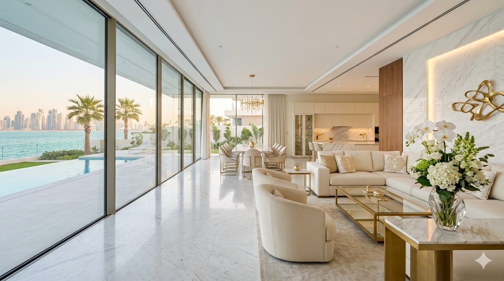

# 🔧 AUTOMATED FIX PROMPT FOR JANAM CLEANING WEBSITE

**Use this prompt to generate automated fixes for the identified issues**

---

## PROMPT: Generate Automated Fixes for Janam Cleaning Website

```
Based on the comprehensive technical audit, generate fixes for the following 
prioritized issues. Use consistent formatting and maintain the design system.

PRIORITY 1 - CRITICAL (Do these first):

1. ADD MISSING og:url META TAGS
   - Add to all service pages (services/*.html)
   - Add to all location pages (locations/*.html)
   - Add to all blog article pages (cost-of-*.html, how-to-*.html, deep-*.html, villa-*.html, same-day-*.html)
   - Format: <meta property="og:url" content="https://www.janamcleaning.qa/[page-path]">

2. ADD MISSING twitter:image META TAGS
   - Add to all pages: index.html, index-ar.html, about.html, about-ar.html, contact.html, contact-ar.html, blog.html
   - Add to all service pages
   - Add to all location pages  
   - Add to all blog article pages
   - Format: <meta name="twitter:image" content="https://www.janamcleaning.qa/images/hero-villa.jpg">

3. ADD MISSING hreflang TAGS TO BLOG ARTICLES
   - cost-of-cleaning-services-doha.html: Add hreflang for en and ar versions
   - how-to-choose-best-cleaning-company-doha.html: Add hreflang for en and ar versions
   - deep-cleaning-qatar-climate.html: Add hreflang for en and ar versions
   - villa-vs-apartment-cleaning-doha.html: Add hreflang for en and ar versions
   - same-day-cleaning-doha.html: Add hreflang for en and ar versions
   - Format: 
     <link rel="alternate" hreflang="en" href="https://www.janamcleaning.qa/[page].html">
     <link rel="alternate" hreflang="ar" href="https://www.janamcleaning.qa/[page]-ar.html">

4. COMPLETE sitemap.xml
   - Add all service pages (services/*.html) with priority 0.7, changefreq monthly
   - Add all location pages (locations/*.html) with priority 0.6, changefreq monthly
   - Add all blog article pages with priority 0.6, changefreq monthly
   - Add hreflang tags for Arabic versions of blog articles
   - Keep existing entries
   - Format for each new entry:
     <url>
       <loc>https://www.janamcleaning.qa/[page]</loc>
       <xhtml:link rel="alternate" hreflang="en" href="https://www.janamcleaning.qa/[page]"/>
       <xhtml:link rel="alternate" hreflang="ar" href="https://www.janamcleaning.qa/[page]-ar"/>
       <changefreq>monthly</changefreq>
       <priority>0.7</priority>
     </url>

5. FIX SVG CLOSING TAGS
   - locations/cleaning-services-west-bay.html: Fix incomplete SVG tag for office cleaning icon
   - Search for pattern: <svg ...><rect ... but no closing </svg>
   - Add proper closure: </svg>
   - Ensure all SVG paths and rects are properly closed with />

PRIORITY 2 - HIGH (Do next):

6. ADD MISSING og:image TAGS TO ARABIC PAGES
   - contact-ar.html: Add <meta property="og:image" content="https://www.janamcleaning.qa/images/hero-villa.jpg">
   - Check all other Arabic pages for missing og:image

7. ADD MISSING hreflang TO SERVICE PAGES
   - All service pages should have en/ar hreflang tags
   - Example for services/home-cleaning-doha.html:
     <link rel="alternate" hreflang="en" href="https://www.janamcleaning.qa/services/home-cleaning-doha.html">
     <link rel="alternate" hreflang="ar" href="https://www.janamcleaning.qa/services/home-cleaning-doha-ar.html">

8. ADD SCHEMA MARKUP TO BLOG ARTICLES
   - how-to-choose-best-cleaning-company-doha.html: Add Article schema
   - deep-cleaning-qatar-climate.html: Add Article schema
   - villa-vs-apartment-cleaning-doha.html: Add Article schema
   - same-day-cleaning-doha.html: Add Article schema
   - Format (before </head>):
     <script type="application/ld+json">
     {
       "@context": "https://schema.org",
       "@type": "Article",
       "headline": "[Page Title]",
       "description": "[Page Description]",
       "image": "https://www.janamcleaning.qa/images/hero-villa.jpg",
       "datePublished": "2025-01-15",
       "author": {
         "@type": "Organization",
         "name": "Janam Cleaning & Hospitality Services"
       }
     }
     </script>

9. ADD ORGANIZATION SCHEMA TO HOMEPAGE
   - index.html and index-ar.html
   - Add before </head>:
     <script type="application/ld+json">
     {
       "@context": "https://schema.org",
       "@type": "Organization",
       "name": "Janam Cleaning & Hospitality Services",
       "url": "https://www.janamcleaning.qa",
       "telephone": "+97431334328",
       "email": "info@janamcleaning.qa",
       "description": "Qatar's premium cleaning company offering home, office, and deep cleaning services",
       "address": {
         "@type": "PostalAddress",
         "addressLocality": "Doha",
         "addressCountry": "QA"
       },
       "areaServed": "Doha, Qatar"
     }
     </script>

10. ADD AGGREGATE RATING SCHEMA
    - Add to Organization schema on homepage
    - Or add to each service page
    - Include:
      "aggregateRating": {
        "@type": "AggregateRating",
        "ratingValue": "4.9",
        "ratingCount": "340",
        "bestRating": "5",
        "worstRating": "1"
      }

11. FIX COLOR CONTRAST ISSUES
    - In style.css, increase opacity for text on dark backgrounds:
      .page-hero .lead: Change color: rgba(255, 255, 255, 0.75) to color: rgba(255, 255, 255, 0.9)
      .page-hero .trust-pill: Change color: rgba(255, 255, 255, 0.65) to color: rgba(255, 255, 255, 0.9)
      .cta-content p: Change color: rgba(255, 255, 255, 0.7) to color: rgba(255, 255, 255, 0.9)

12. ADD FOCUS STYLES FOR KEYBOARD ACCESSIBILITY
    - In style.css, add:
      .btn--primary:focus-visible {
        outline: 2px solid var(--accent);
        outline-offset: 2px;
      }
      .nav-item a:focus-visible {
        outline: 2px solid var(--accent);
        outline-offset: 2px;
      }
      .form-input:focus-visible,
      .form-select:focus-visible,
      .form-textarea:focus-visible {
        outline: 2px solid var(--accent);
        outline-offset: 2px;
      }

PRIORITY 3 - MEDIUM (Do soon):

13. ADD ALT TEXT TO ALL IMAGES
    - Audit each HTML file for  tags
    - Add descriptive alt text for all images
    - Examples:
      
      

14. FIX FORM ACCESSIBILITY
    - In contact.html and contact-ar.html:
      - Add 'for' attribute to all labels linking to input ids
      - Add 'required' and 'aria-required' to required fields
      - Add 'aria-describedby' to link error messages
      - Example:
        <label class="form-label" for="name">Full Name</label>
        <input class="form-input" type="text" id="name" name="name" required aria-required="true">

15. OPTIMIZE IMAGES
    - Convert JFIF images to WebP (.jfif → .webp)
    - Add loading="lazy" to below-the-fold images
    - Use responsive srcset for images:
      

16. ADD SKIP-TO-CONTENT LINK
    - Add to all HTML files before <header>
    - Add CSS for skip link:
      .skip-link {
        position: absolute;
        top: -40px;
        left: 0;
        background: var(--accent);
        color: white;
        padding: 8px 16px;
        z-index: 100;
      }
      .skip-link:focus {
        top: 0;
      }
    - Add in body:
      <a href="#main-content" class="skip-link">Skip to main content</a>

17. ADD FALLBACK FOR INTERSECTION OBSERVER
    - In main.js, wrap:
      if ('IntersectionObserver' in window) {
        var observer = new IntersectionObserver(...);
      } else {
        document.querySelectorAll('.reveal').forEach(function(el) {
          el.classList.add('visible');
        });
      }

PRIORITY 4 - LOW (Nice to have):

18. MINIFY CSS AND JAVASCRIPT
    - Minify style.css for production
    - Minify main.js and components.js for production
    - Expected 30-35% size reduction

19. ADD ARIA LABELS TO ICON BUTTONS
    - Hamburger button already has aria-label ✅
    - Check other icon-only buttons for aria-label or aria-labelledby

20. DELETE EMPTY FILES
    - Delete trial.html if not needed
    - Add __pycache__ to .gitignore
    - Remove __pycache__ from production

CONTENT CREATION TASKS:

21. CREATE ARABIC BLOG ARTICLE PAGES
    - Create: cost-of-cleaning-services-doha-ar.html (Arabic translation)
    - Create: how-to-choose-best-cleaning-company-doha-ar.html (Arabic translation)
    - Create: deep-cleaning-qatar-climate-ar.html (Arabic translation)
    - Create: villa-vs-apartment-cleaning-doha-ar.html (Arabic translation)
    - Create: same-day-cleaning-doha-ar.html (Arabic translation)
    - Ensure proper lang="ar" dir="rtl" attributes
    - Add hreflang tags
    - Add to sitemap

22. IMPLEMENT TRIAL PAGE
    - Decide if trial.html should be used
    - If yes: implement trial/booking page with proper HTML structure
    - If no: delete the file

---

## VALIDATION CHECKLIST

After making fixes, validate:

- [ ] All pages have og:url meta tags
- [ ] All pages have twitter:image meta tags
- [ ] Blog pages have hreflang tags
- [ ] Service pages have hreflang tags
- [ ] Sitemap includes all pages with hreflang
- [ ] All SVG tags are properly closed
- [ ] Schema markup is valid (test in Schema.org validator)
- [ ] Color contrast passes WCAG AA
- [ ] All images have alt text
- [ ] Form fields have proper labels and aria attributes
- [ ] Focus styles visible on all interactive elements
- [ ] Skip-to-content link present
- [ ] Arabic pages have lang="ar" and dir="rtl"
- [ ] No console errors in browser
- [ ] Mobile responsiveness tested
- [ ] Keyboard navigation tested

---

## TESTING TOOLS

- **W3C HTML Validator:** https://validator.w3.org/
- **Schema.org Validator:** https://validator.schema.org/
- **WAVE Accessibility:** https://wave.webaim.org/
- **Lighthouse:** Built into Chrome DevTools
- **Google Search Console:** Check indexation and coverage
- **WCAG Contrast Checker:** https://webaim.org/resources/contrastchecker/
- **Responsive Design Tester:** Chrome DevTools

---

## IMPLEMENTATION NOTES

- Maintain existing CSS variable structure
- Keep responsive design breakpoints
- Preserve language-switching functionality
- Ensure Arabic pages mirror English structure
- Test all links and navigation
- Verify email/phone links work
- Check WhatsApp links work correctly
